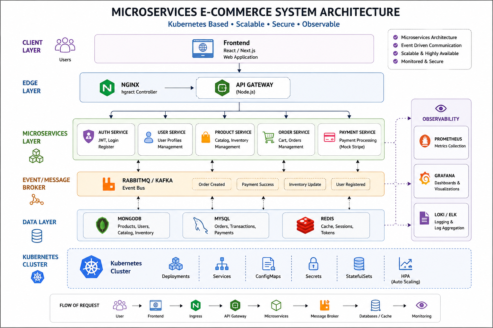
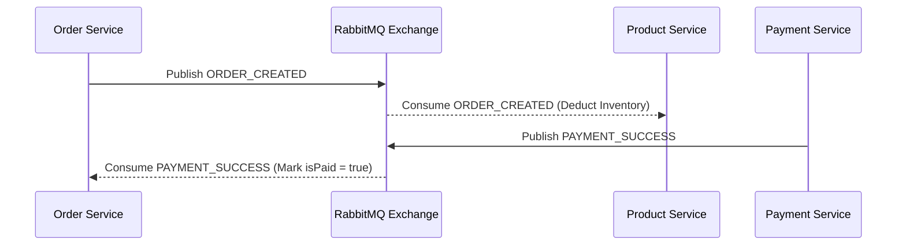

# Microservices E-Commerce API Design & Specifications

This document outlines the API design, microservice communication patterns, and route specifications for the E-Commerce platform.



---

## 🌐 API Gateway Routing Overview

All external frontend and client traffic flows through the **API Gateway** (default port `8000` locally, port `8080` in Kubernetes cluster).

| Route Prefix | Target Service | Internal Port | Description |
| :--- | :--- | :--- | :--- |
| `/api/auth` | `auth-service` | `5000` | Authentication, registration, and JWT token issuance |
| `/api/users` | `user-service` | `5001` | User profile retrieval and management |
| `/api/products` | `product-service` | `5002` | Product catalogue, search, inventory, and admin management |
| `/api/orders` | `order-service` | `5003` | Order creation, listing, status updates, and history |
| `/api/payments` | `payment-service` | `5004` | Payment processing and transaction verification |

---

## 📦 Service API Endpoints

### 1. Auth Service (`/api/auth`)

* **`POST /api/auth/register`**
  * **Description:** Register a new user account.
  * **Request Body:**
    ```json
    {
      "username": "johndoe",
      "email": "john@example.com",
      "password": "SecurePassword123!"
    }
    ```
  * **Response (`201 Created`):**
    ```json
    {
      "status": "success",
      "message": "User registered successfully",
      "data": {
        "user": { "_id": "...", "username": "johndoe", "email": "john@example.com", "role": "user" }
      }
    }
    ```

* **`POST /api/auth/login`**
  * **Description:** Authenticate user and return a JWT bearer token.
  * **Request Body:**
    ```json
    {
      "email": "john@example.com",
      "password": "SecurePassword123!"
    }
    ```
  * **Response (`200 OK`):**
    ```json
    {
      "status": "success",
      "token": "eyJhbGciOiJIUzI1NiIsInR5cCI6IkpXVCJ9...",
      "data": {
        "user": { "_id": "...", "username": "johndoe", "email": "john@example.com", "role": "user" }
      }
    }
    ```

---

### 2. User Service (`/api/users`)

* **`GET /api/users/profile`**
  * **Auth Required:** `Bearer <token>`
  * **Description:** Returns the authenticated user's profile.

* **`PUT /api/users/profile`**
  * **Auth Required:** `Bearer <token>`
  * **Description:** Update authenticated user profile details.

---

### 3. Product Service (`/api/products`)

* **`GET /api/products`**
  * **Description:** Retrieve a list of products with optional filtering.
  * **Query Parameters:** `category`, `search`, `page`, `limit`
  * **Response (`200 OK`):**
    ```json
    {
      "status": "success",
      "data": {
        "products": [
          {
            "_id": "...",
            "name": "Wireless Noise Cancelling Headphones",
            "price": 199.99,
            "category": "Headphones",
            "stock": 50,
            "images": [{ "url": "https://..." }]
          }
        ]
      }
    }
    ```

* **`GET /api/products/:id`**
  * **Description:** Get detailed information for a single product by ID.

* **`POST /api/products`**
  * **Auth Required:** `Bearer <token>` (Admin Role)
  * **Description:** Create a new product.

* **`PUT /api/products/:id`**
  * **Auth Required:** `Bearer <token>` (Admin Role)
  * **Description:** Update product details and inventory.

* **`DELETE /api/products/:id`**
  * **Auth Required:** `Bearer <token>` (Admin Role)
  * **Description:** Delete a product from catalogue.

---

### 4. Order Service (`/api/orders`)

* **`POST /api/orders`**
  * **Auth Required:** `Bearer <token>`
  * **Description:** Create a new order. Emits an asynchronous `ORDER_CREATED` event to RabbitMQ.
  * **Request Body:**
    ```json
    {
      "orderItems": [
        { "product": "product_id", "name": "Headphones", "price": 199.99, "qty": 1 }
      ],
      "shippingAddress": { "address": "123 Main St", "city": "City", "postalCode": "12345", "country": "Country" },
      "paymentMethod": "Credit Card",
      "itemsPrice": 199.99,
      "taxPrice": 20.00,
      "shippingPrice": 0.00,
      "totalPrice": 219.99
    }
    ```

* **`GET /api/orders/myorders`**
  * **Auth Required:** `Bearer <token>`
  * **Description:** List all orders belonging to the authenticated user.

* **`GET /api/orders/:id`**
  * **Auth Required:** `Bearer <token>`
  * **Description:** Get specific order details.

* **`PUT /api/orders/:id/pay`**
  * **Auth Required:** `Bearer <token>`
  * **Description:** Mark order as paid upon successful payment processing.

---

### 5. Payment Service (`/api/payments`)

* **`POST /api/payments/process`**
  * **Auth Required:** `Bearer <token>`
  * **Description:** Process payment transaction. Emits `PAYMENT_SUCCESS` event to RabbitMQ upon completion.

---

## ⚡ Asynchronous Event Flow (RabbitMQ)


